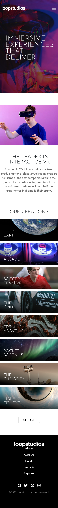

# Frontend Mentor - Loopstudios landing page solution

This is a solution to the [Loopstudios landing page challenge on Frontend Mentor](https://www.frontendmentor.io/challenges/loopstudios-landing-page-N88J5Onjw). Frontend Mentor challenges help you improve your coding skills by building realistic projects. 

## Table of contents

- [Overview](#overview)
  - [The challenge](#the-challenge)
  - [Screenshot](#screenshot)
  - [Links](#links)
  - [Built with](#built-with)
  - [Author](#author)

**Note: Delete this note and update the table of contents based on what sections you keep.**

## Overview

### The challenge

Users should be able to:

- View the optimal layout for the site depending on their device's screen size
- See hover states for all interactive elements on the page

### Screenshot

### Links

- Solution URL: [Click here](https://www.frontendmentor.io/solutions/mobile-first-html-sass-js-1FX-pSIi5)
- Live Site URL: [Click here](https://hatwell-jonel.github.io/frontendmentor-loopstudio/)

### Built with

- Semantic HTML5 markup
- SCSS
- Flexbox
- Grid
- Bootstrap 5
- Javascript

**Note: These are just examples. Delete this note and replace the list above with your own choices**

## Author

- Linkedin - [Jonel Hatwell](https://www.linkedin.com/in/jonel-hatwell/)
- Frontend Mentor - [@hatwell-jonel](https://www.frontendmentor.io/profile/hatwell-jonel)

**Note: Delete this note and add/remove/edit lines above based on what links you'd like to share.**
